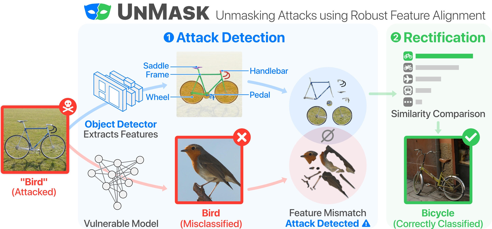

# UnMask: Adversarial Detection and Defense in Deep Learning Through Building-Block Knowledge Extraction

Accepted to IEEE Big Data 2021. Full paper can be found here: https://arxiv.org/pdf/2002.09576.pdf
### Overview:

To combat adversarial attacks on deep learning models, we developed **UnMask**, 
a knowledge-based adversarial detection and defense framework. 
The core idea behind UnMask is to protect vulnerable deep learning models by verifying that an image's 
predicted class ("bird") contains the expected building blocks (e.g., beak, wings, eyes). 
For example, if an image is classified as "bird", but the extracted building-blocks are 
*wheel*, *seat* and *frame*, we can utilize this information to alert of an potential attack 
and re-classify the image based on it's building blocks. 



Extensive evaluation shows that UnMask (1) *detects* up to 96.75% of attacks, with a false positive rate 
of 9.66% and (2) *defends* the model by correctly classifying up to 93% of adversarial images 
produced by the current strongest attack, Projected Gradient Descent, in the gray-box setting.
In addition, UnMask performs 31.18% better than adversarial training when averaged across 
8 attack vectors. Our proposed method is architecture agnostic and fast.

### Setup:

We run the experiments in a Linux environment using Python 3, on 2 Nvidia Titan X's, a Titan RTX 
and an Nvidia DGX. We note that a single Nvidia GPU is sufficient to 
recreate all of the experiments, however, we recommend that the GPU has at least 12GB of 
memory (not tested with less). However, be believe that that less GPU memory should work
without issues.

We utilize Anaconda 3 to manage all of the Python packages. To facilitate reproducibility 
of the Python environment, we release an Anaconda YAML specification file of the libraries 
utilized in the experiments. This allows the user to create a new virtual Python environment 
with all of the packages required to run the code by importing the YAML file. 
In addition, we utilize two Github repositories in the code base---(i) for the mask 
R-CNN model and (ii) to assist in the development 
of the dataset. Since there are significant 
modifications from the original implementation, it's necessary for the user to utilize the 
provided version.

(i) https://github.com/matterport/Mask_RCNN

(ii) https://github.com/waspinator/pycococreator

### UnMask Dataset:
We contribute a new dataset incorporating four components--PASCAL-Part, PASCAL VOC 2010, 
a subset of ImageNet and images scraped from Flickr. 
The goal of this curation is to (i) collect all of the data used in our evaluation as a single 
source to promote ease of reproducibility by our research community, and 
(ii) to increase the number of images available for evaluating the performance of the deep 
learning models and the UnMask defense framework. We designed multiple *class sets* 
with varying number of classes and feature overlap (e.g., CS3a)
to study how they would affect detection and defense effectiveness.

### Models:
There are two models that we train and evaluate--(1) the deep learning model we 
are protecting (M) and (2) the building-block knowledge extraction model (K). 

**Model M:** To train each model M, we utilize a subset of the Pascal VOC 2010 dataset, 
taking only images containing a single object (no multi-class images); and a subset
of the images from ImageNet. The total number of 
images that each model M utilizes for training, validation and testing depends on the class set.
Additional information, can be found in the paper.

**Model K:** To train the feature extraction model K, we utilize the Pascal Part 
dataset containing 9,323 images for training, validation and testing, with ratios of 
80/10/10, respectively. We follow a similar training and evaluation procedure described 
in (https://github.com/matterport/Mask_RCNN) training for 40 epochs with basic data augmentation. 
To the best of our knowledge this is the first mask R-CNN model developed to work with the 
Pascal Part dataset.

In the Dropbox link below we provide 2 models, one of model M and one of Model K.

### Download the dataset and models:


In order to run the code, download and unzip the **"data"** folder inside the 
main code directory. The dataset folder can be downloaded from 
[here](https://www.dropbox.com/s/4lggy06t70wr4ba/data.zip?dl=0).

In addition, download the two files **mask_rcnn_coco.h5** and **mask_rcnn_parts_0040.h5** from 
[here](https://www.dropbox.com/s/d4e0x2r82h266k6/mask_rcnn_coco.h5?dl=0) 
and [here](https://www.dropbox.com/s/5l9cktsandce8ma/mask_rcnn_parts_0040.h5?dl=0), 
respectively. Place the mask_rcnn_parts_0040.h5 file inside the Mask_RCNN/logs/model_k 
folder and place mask_rcnn.coco.h5 inside Mask_RCNN folder.

### Running the code:

Environment Setup: 
````
    1. Setup a Linux environment (not tested for Windows) with an Nvidia GPU containing at least 12GB of memory (less may work, but not tested).
    2. Download the open-sourced code, dataset and models from Github.
    3. Create a virtual Python environment using the provided YAML configuration file on Github.
    4. Activate the new virtual Python environment
````
Parameters:

* Model(s): the user can select between a few models. [ResNet50, DenseNet121]

* Class set: the class set to utilize when evaluating UnMask. [cs3-1, cs3-2, cs5-1, cs5-2]

**Running UnMask:**
In order to run UnMask, run the main.py file. Parameter options can be set in config.py. 
